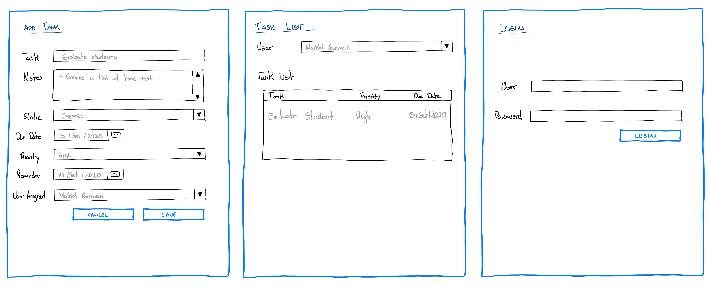
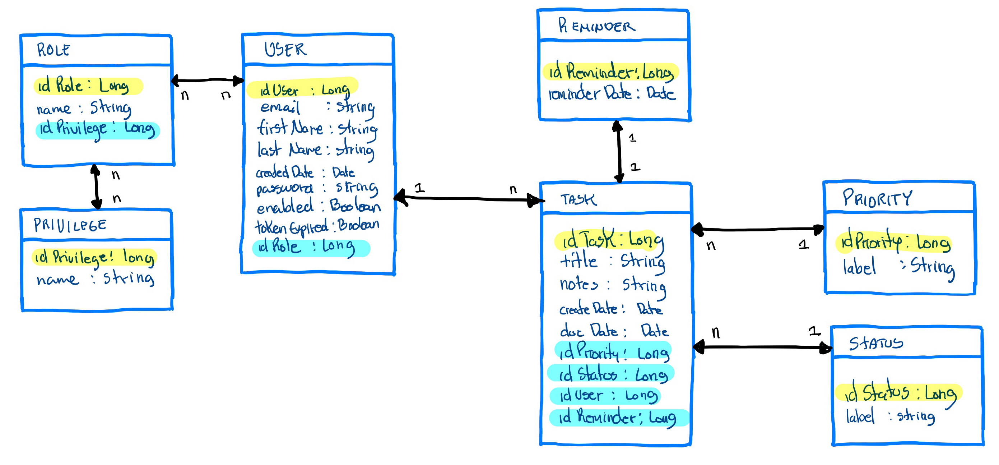
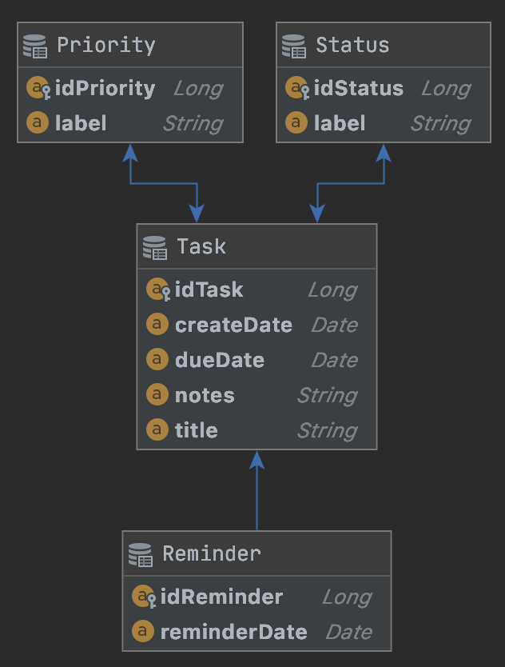

# Data Layer

ToDo app to manage task, this example is the data layer using Spring Boot and Hibernate with Gradle.

## Wireframes

## Entity Relationship Diagram

In this plan, we will have different entities and relationship between them.

### Initial Plan

### Actual Design

